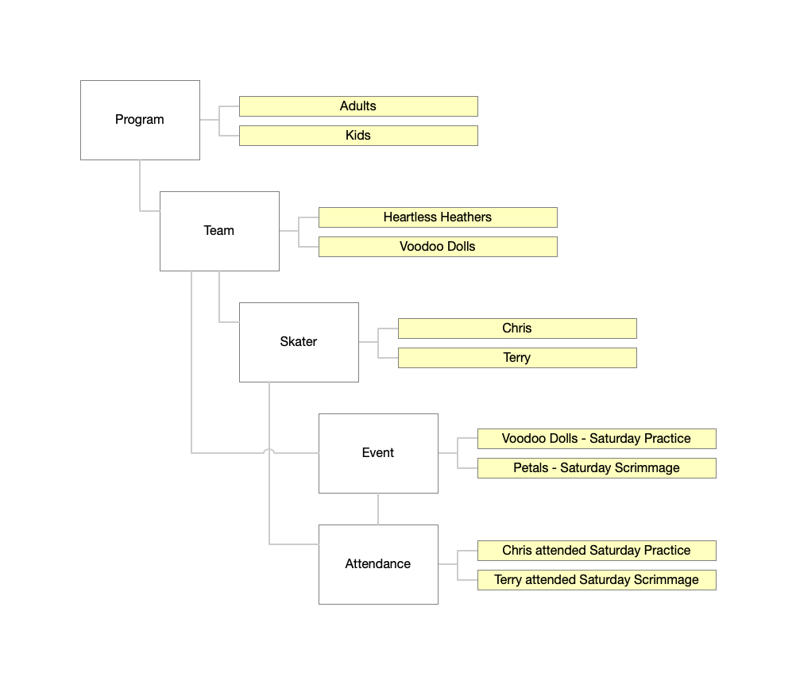
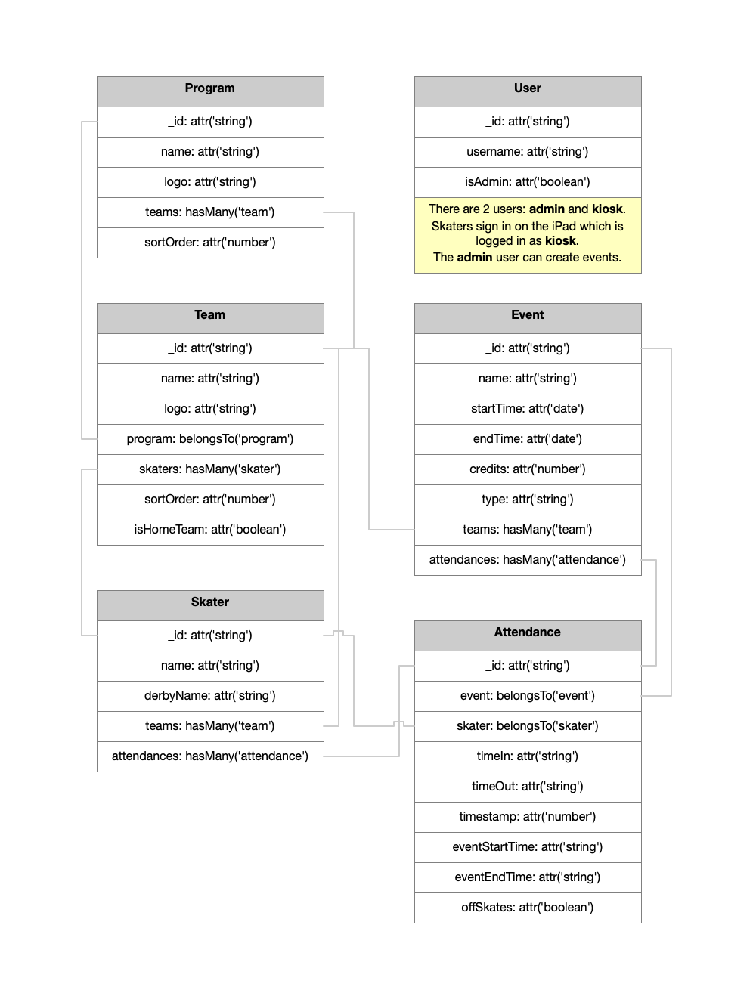

# rcr-attendance
ember js frontend to track practice attendances

## Prerequisites

You will need the following things properly installed on your computer.

* [Git](https://git-scm.com/)
* [Node.js](https://nodejs.org/) (with npm)
* [Ember CLI](https://ember-cli.com/)
* [Google Chrome](https://google.com/chrome/)

## Installation

* `git clone <repository-url>` this repository
* `cd rcr-attendance`
* `npm install`

## Running / Development

* `ember serve`
* Visit your app at [http://localhost:4200](http://localhost:4200).
* Visit your tests at [http://localhost:4200/tests](http://localhost:4200/tests).
* By default, it will expect a localhost backend, see: [rcr-attendance-data](https://github.com/yakmatter/rcr-attendance-data)

### Running Tests

* `ember test`
* `ember test --server`

### Linting

* `npm run lint:hbs`
* `npm run lint:js`
* `npm run lint:js -- --fix`

### Building

* `ember build` (development)
* `ember build --environment production` (production)

## Further Reading / Useful Links

* [ember.js](https://emberjs.com/)
* [ember-cli](https://ember-cli.com/)
* Development Browser Extensions
  * [ember inspector for chrome](https://chrome.google.com/webstore/detail/ember-inspector/bmdblncegkenkacieihfhpjfppoconhi)
  * [ember inspector for firefox](https://addons.mozilla.org/en-US/firefox/addon/ember-inspector/)

## Data Overview

A practice or scrimmage is an **Event**. When an **Event** is created, we associate one or more **Team**s and create an empty **Attendance** for each **Skater** on the related **Team**s.

The existence of an **Attendance** indicates a **Skater** was expected to be at an **Event**.
When a **Skater** checks in we update `attendance.timeIn` and `attendance.timeOut`, which indicates they attended.

If a **Skater** “drops in” on a practice, we create a new **Attendance** for that **Event** and set `attendance.timeIn` and `attendance.timeOut`.

## Schema
This diagram should provide a reasonable overview of how the models are related.
